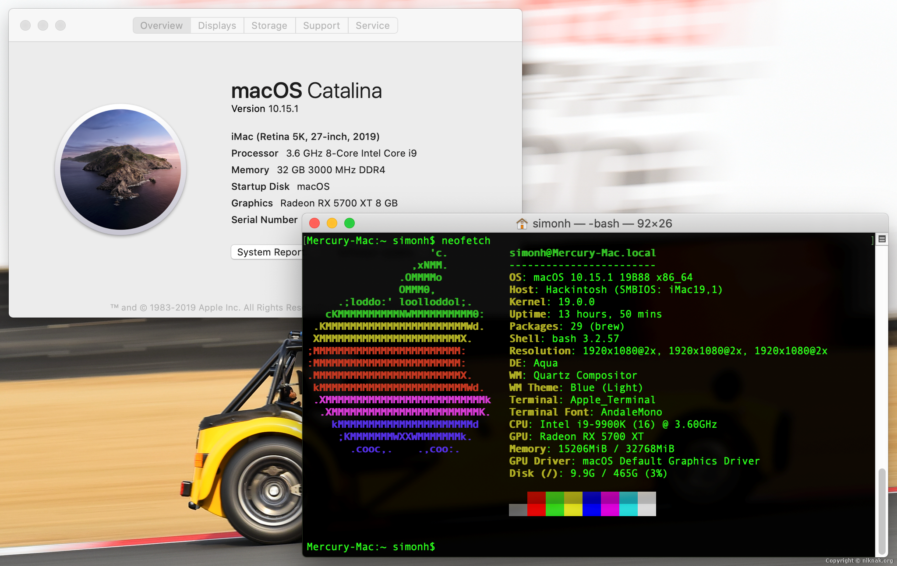

# Hackintosh
Files and info relating to my hackintosh build

Reddit build thread: https://www.reddit.com/r/hackintosh/comments/dy4zcp/another_i99900kz390_designare5700xt_success_story/

* Intel Core i9-9900K CPU
* Corsair H100x CPU cooler
* Gigabyte Z390 Designare motherboard
* Corsair Vengeance LPX 32 GB DDR4-3000 memory
* Samsung 970 Evo Plus 500 GB M.2-2280 NVME SSD (macOS)
* Samsung 970 Evo Plus 1 TB M.2-2280 NVME SSD (macOS user profile)
* Samsung 860 Evo 1 TB 2.5" SSD (Windows 10)
* PowerColor Radeon RX 5700 XT 8 GB Red Devil GPU
* Silverstone Strider Titanium 800 W 80+ Titanium PSU
* Broadcom BCM94360CS2 wifi/BT adapter
* Dell P2415Q 23.8" 4k monitor (x3)
* Logitech MX Keys keyboard
* Logitech G502 Lightspeed mouse
* Noctua fans
* Apple Mac G5 case (free) with Laser Hive conversion parts

Full build images here, including all the case modification work: https://imgur.com/gallery/evzOYV9

Please note - EFI is just for reference, kexts etc. may not be current.
